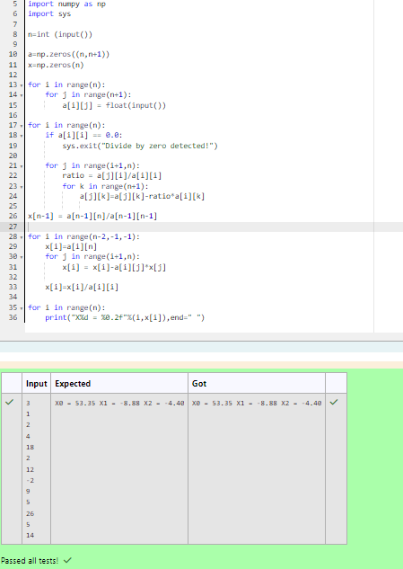

# Gaussian Elimination

## AIM:
To write a program to find the solution of a matrix using Gaussian Elimination.

## Equipments Required:
1. Hardware – PCs
2. Anaconda – Python 3.7 Installation / Moodle-Code Runner

## Algorithm
1. Matrix Initialization: The code initializes two numpy arrays, a and x, to represent the coefficient matrix and the solution vector respectively. The size of the matrix is determined by user input.
2. Pivot Element Selection: The algorithm iterates over each row of the matrix and checks if the diagonal element (pivot) is zero. If a zero pivot is encountered, the program exits with an error message to avoid division by zero.
3. Row Operations: For each pivot element, the algorithm performs row operations to eliminate the coefficients below the pivot. It calculates a ratio between the element below the pivot and the pivot itself, then subtracts a multiple of the current row from subsequent rows to eliminate the coefficient.
4. Back Substitution: Once the matrix is transformed into upper triangular form, the algorithm proceeds to back substitution. Starting from the last row, it solves for each variable by substituting known values of the variables found so far.
5. Output: Finally, the solution vector is printed, showing the values of the variables obtained from the Gaussian Elimination process.


## Program:
```

Program to find the solution of a matrix using Gaussian Elimination.
Developed by: S.Sajetha
RegisterNumber: 212223100049


import numpy as np
import sys

n=int (input())

a=np.zeros((n,n+1))
x=np.zeros(n)

for i in range(n):
    for j in range(n+1):
        a[i][j] = float(input())

for i in range(n):
    if a[i][i] == 0.0:
        sys.exit("Divide by zero detected!")
        
    for j in range(i+1,n):
        ratio = a[j][i]/a[i][i]
        for k in range(n+1):
            a[j][k]=a[j][k]-ratio*a[i][k]
                
x[n-1] = a[n-1][n]/a[n-1][n-1]

for i in range(n-2,-1,-1):
    x[i]=a[i][n]
    for j in range(i+1,n):
        x[i] = x[i]-a[i][j]*x[j]
        
    x[i]=x[i]/a[i][i]
    
for i in range(n):
    print("X%d = %0.2f"%(i,x[i]),end=" ")
```

## Output:



## Result:
Thus the program to find the solution of a matrix using Gaussian Elimination is written and verified using python programming.

